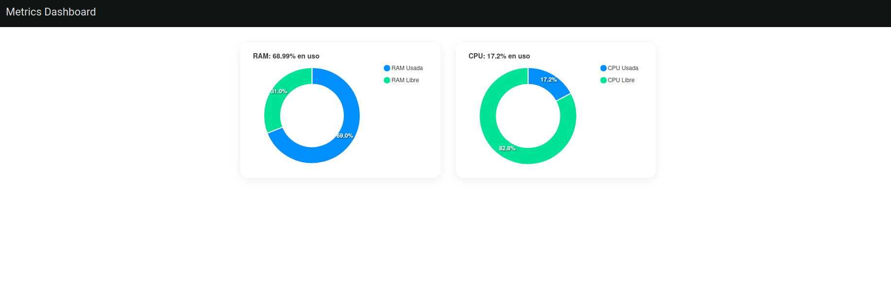
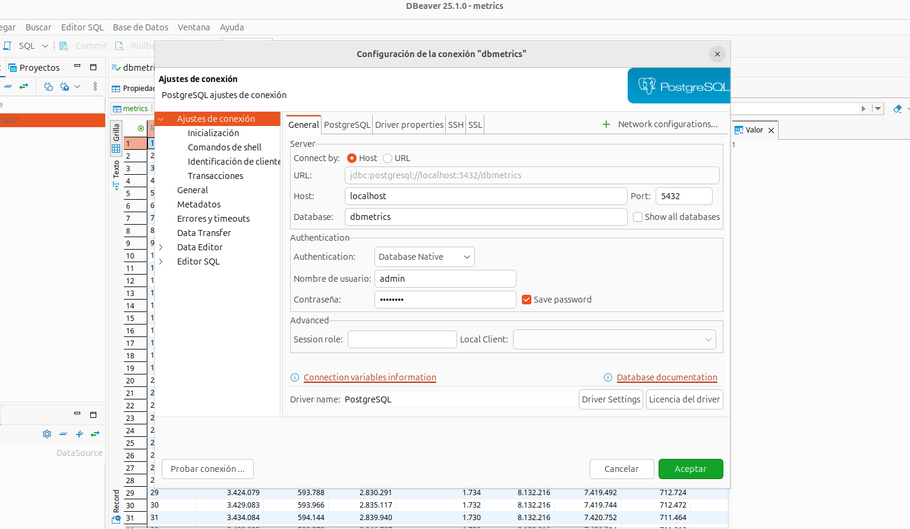

# **Agente de Monitoreo**

## **Índice**

- [**Agente de Monitoreo**](#agente-de-monitoreo)
  - [**Índice**](#índice)
  - [**Introducción**](#introducción)
  - [**Requerimientos del Sistema**](#requerimientos-del-sistema)
  - [**Estructura del Proyecto** 🗂️](#estructura-del-proyecto-️)
  - [**Módulos**](#módulos)
    - [**CPU**](#cpu)
      - [**Funcionamiento del Módulo CPU:**](#funcionamiento-del-módulo-cpu)
    - [**RAM**](#ram)
    - [**Funcionamiento del Módulo RAM:**](#funcionamiento-del-módulo-ram)
      - [**Lectura de Datos:**](#lectura-de-datos)
      - [**Cálculo de Métricas:**](#cálculo-de-métricas)
      - [**Exposición de Datos:**](#exposición-de-datos)
      - [**Ciclo de Vida:**](#ciclo-de-vida)
  - [**Backend**](#backend)
    - [**API**](#api)
    - [**Recolector**](#recolector)
    - [**Recolectores:**](#recolectores)
    - [**Unificación de Métricas:**](#unificación-de-métricas)
    - [**Envío a la API:**](#envío-a-la-api)
  - [**Implementación de Concurrencia y Canales en Go**](#implementación-de-concurrencia-y-canales-en-go)
    - [**Goroutines y Canales:**](#goroutines-y-canales)
      - [**Goroutines**](#goroutines)
        - [**Recolector de RAM:**](#recolector-de-ram)
      - [**Canales**](#canales)
  - [**Unificación de Métricas**](#unificación-de-métricas-1)
  - [**Función de Envío a la API**](#función-de-envío-a-la-api)
  - [**Comunicación con la API**](#comunicación-con-la-api)
    - [**Configuración de la API:**](#configuración-de-la-api)
    - [**Envío de Métricas:**](#envío-de-métricas)
  - [**Frontend**](#frontend)
    - [**Vista Principal**](#vista-principal)
  - [**DB - PostgreSQL**](#db---postgresql)
  - [**Bash Scripts**](#bash-scripts)
  - [**Docker y Docker Compose**](#docker-y-docker-compose)

## **Introducción**

Este proyecto se encarga de monitorear las métricas del sistema, específicamente el uso de la CPU y la RAM, utilizando un agente en **Golang** que recupera las métricas desde los módulos cargados en el sistema operativo. Estas métricas se almacenan en una base de datos **PostgreSQL** y se exponen a través de una **API** creada con **Node.js**, las cuales son visualizadas mediante una aplicación frontend desarrollada con **Angular**.

## **Requerimientos del Sistema**

El proyecto debe ejecutarse en un sistema operativo basado en **Ubuntu 24.04** y requiere las siguientes instalaciones previas:

1. **Node.js**: Para la API y el frontend.
2. **Angular CLI**: Para compilar y servir el proyecto Angular.
3. **PostgreSQL**: Base de datos para almacenar las métricas.
4. **DBeaver**: Cliente gráfico para la gestión de la base de datos.
5. **Visual Studio Code**: Editor de código recomendado.
6. **Compilador de C**: Para compilar los módulos de **CPU** y **RAM**.
7. **Golang**: Para el desarrollo del recolector de métricas.
8. **npm**: Gestor de paquetes de Node.js.
9. **Docker**: Para contenedores y despliegue del proyecto.
10. **Docker Compose**: Para la orquestación de los contenedores.

## **Estructura del Proyecto** 🗂️

El proyecto está organizado en las siguientes carpetas:

- **`Backend`**: Contiene el código backend del proyecto.
  - **`API`**: La API que expone las métricas utilizando **Node.js**.
  - **`Recolector`**: Código del recolector de métricas, implementado en **Golang**.

- **`Frontend`**: Contiene la aplicación **Angular** que se encarga de visualizar las métricas.
  - **`Metrics`**: Carpeta con el proyecto de Angular.

- **`DB`**: Contiene scripts para la base de datos **PostgreSQL**.
  - **`scripts`**: Carpeta con los scripts para inicializar la base de datos.

- **`Bash-scripts`**: Scripts para automatización.
  - **`clean_all.sh`**: Purga todo el sistema.
  - **`run_all.sh`**: Crea y carga los módulos, levanta las imágenes.
  - **`stress_containers.sh`**: Levanta contenedores para estresar el sistema y los reinicia.

- **`Modules`**: Contiene los módulos de monitoreo de **CPU** y **RAM**.
  - **`CPU`**: Código en C para monitorear el uso de la CPU.
  - **`RAM`**: Código en C para monitorear el uso de la RAM.

## **Módulos**

Los módulos de monitoreo se encuentran en la carpeta **`Modules`** y están escritos en **C**:

### **CPU**

El archivo `cpu_201904013.c` contiene la lógica para medir el uso de la CPU. El código se compila y se carga en la carpeta `/proc` del sistema operativo mediante un archivo `Makefile`.

Este módulo permite monitorear el uso de la **CPU** del sistema, calculando la cantidad total de tiempo de CPU utilizado por los procesos y el porcentaje de uso de la CPU en relación al tiempo total disponible.

#### **Funcionamiento del Módulo CPU:**

1. **Lectura de Datos:**
   - El módulo calcula el tiempo total de uso de la CPU sumando los tiempos de usuario (`utime`) y sistema (`stime`) de todos los procesos activos del sistema.
   - Obtiene el tiempo total disponible de la CPU desde el arranque utilizando la función `ktime_get()`.
   
2. **Cálculo de Métricas:**
   - Calcula el porcentaje de uso de la CPU con la fórmula:
     ```c
     porcentaje = (uso_cpu * 10000) / total_cpu;
     ```
     Donde:
     - `uso_cpu` es la suma del tiempo de usuario y de sistema de todos los procesos.
     - `total_cpu` es el tiempo total disponible de la CPU.
   
3. **Exposición de Datos:**
   - Los datos de la CPU (tiempo total, uso, libre y porcentaje de uso) se exponen a través del archivo `/proc/cpu_201904013`.
   - La función `escribir_cpu` se encarga de formatear los datos en formato JSON y escribirlos en el archivo.

4. **Ciclo de Vida:**
   - Al cargar el módulo, se crea el archivo `/proc/cpu_201904013` utilizando `proc_create`.
   - Al descargar el módulo, el archivo se elimina con `remove_proc_entry`.

### **RAM**

Similar al módulo de **CPU**, el archivo `ram_201904013.c` mide el uso de la memoria RAM y también se compila y carga en `/proc` mediante su propio `Makefile`.

Este módulo permite monitorear el uso de la **RAM** del sistema, proporcionando información sobre el total de memoria, la memoria libre, la memoria utilizada y el porcentaje de uso.

### **Funcionamiento del Módulo RAM:**

#### **Lectura de Datos:**

Obtiene la información del sistema sobre la memoria utilizando la función `si_meminfo`, que llena una estructura `sysinfo` con detalles sobre la memoria total y libre.

#### **Cálculo de Métricas:**

- El total de la memoria se calcula en **KB** multiplicando `info.totalram` por el tamaño de una unidad de memoria (`info.mem_unit`).
  
- Se calcula el porcentaje de memoria utilizada con la fórmula:
  
  ```c
  porcentaje = (uso * 10000) / total;
  ```

#### **Exposición de Datos:**

- Los datos de la RAM (total, usado, libre y porcentaje de uso) se exponen en formato **JSON** a través del archivo `/proc/ram_201904013`.

- La función `escribir_ram` se encarga de formatear y escribir los datos.

#### **Ciclo de Vida:**

- Al cargar el módulo, se crea el archivo `/proc/ram_201904013` utilizando `proc_create`.
  
- Al descargar el módulo, el archivo se elimina con `remove_proc_entry`.


## **Backend**

### **API**

La carpeta **API** contiene la lógica para la API que expone las métricas del sistema a través de HTTP. Los principales archivos son:

- **`server.js`**: El archivo principal que inicializa el servidor HTTP.
- **`metrics.service.js`**: Maneja la lógica para obtener y formatear las métricas desde la base de datos.
- **`db.js`**: Conexión a la base de datos **PostgreSQL**.

### **Recolector**


El agente tiene la siguiente arquitectura:

### **Recolectores:**

- El **Recolector de RAM** lee las métricas de RAM desde el archivo `/proc/ram_201904013`.
- El **Recolector de CPU** lee las métricas de CPU desde el archivo `/proc/cpu_201904013`.

### **Unificación de Métricas:**

Las métricas de **CPU** y **RAM** se unifican en una estructura común llamada `MetricsPayload`.

### **Envío a la API:**

Las métricas unificadas se envían a una **API REST** a través de una solicitud HTTP **POST**.

---

## **Implementación de Concurrencia y Canales en Go**

La concurrencia en este proyecto se implementa utilizando **goroutines** y **canales** en Go. A continuación se explica cómo se implementan.

### **Goroutines y Canales:**

#### **Goroutines**

Las **goroutines** se utilizan para ejecutar funciones de forma concurrente en el programa. Cada uno de los recolectores de métricas (RAM y CPU) se ejecuta en su propia **goroutine**, lo que permite que ambas métricas se recojan al mismo tiempo sin bloquearse mutuamente.

##### **Recolector de RAM:**

La función `recolectorRam` se ejecuta como una goroutine que lee las métricas de RAM cada 5 segundos desde el archivo `/proc/ram_201904013` y envía los resultados a un canal `ramCh`:

```go
go recolectorRam(ramCh)
```


#### **Canales**

Los **canales** en Go son utilizados para pasar datos entre las **goroutines**. En este caso, se utilizan para transferir las métricas de los recolectores de **RAM** y **CPU** a una función unificadora que las combina en una sola estructura `MetricsPayload`.

- **`metricsChan`**: Este canal se utiliza para enviar las métricas unificadas a la función que las envía a la API.
- **`ramCh` y `cpuCh`**: Son los canales que reciben las métricas de RAM y CPU respectivamente, de las goroutines `recolectorRam` y `recolectorCpu`.

---

## **Unificación de Métricas**

La función `unificarMetricas` está encargada de combinar las métricas de **RAM** y **CPU** en un solo objeto `MetricsPayload`. Esta función recibe los datos de los canales `ramCh` y `cpuCh`, y las inserta en el canal `metricsChan`:

```go
go unificarMetricas(ramCh, cpuCh)
```

Cada vez que recibe nuevas métricas, las unifica y las envía a `metricsChan`, que luego será utilizado para enviar los datos a la API.

---

## **Función de Envío a la API**

La función `enviarAPI` lee las métricas del canal `metricsChan`, las serializa a formato **JSON** y las envía a la API utilizando una solicitud HTTP **POST**. Esta función también se ejecuta en una goroutine para que pueda operar de manera concurrente sin bloquear el resto del programa:

```go
go enviarAPI()
```

El código de la función `enviarAPI` se asegura de que las métricas se envíen a la API cada 5 segundos y maneja los errores de manera adecuada.

---

## **Comunicación con la API**

El agente de monitoreo se comunica con la API de la siguiente manera:

### **Configuración de la API:**

La dirección de la API se construye utilizando las variables de entorno `API_HOST` y `API_PORT`. Estas variables deben estar definidas en el entorno de ejecución o pueden ser configuradas en un archivo `.env`.

### **Envío de Métricas:**

Las métricas recolectadas (CPU y RAM) son unificadas en un objeto `MetricsPayload`, y luego se envían a la API utilizando el siguiente código:

```go
jsonData, err := json.Marshal(metrics)
if err != nil {
    log.Println("Error serializando JSON:", err)
    continue
}

resp, err := http.Post(apiURL, "application/json", bytes.NewBuffer(jsonData))
if err != nil {
    log.Println("Error enviando a la API:", err)
    continue
}

defer resp.Body.Close()
log.Println("Métricas enviadas correctamente ✅")
```

La API recibe los datos en formato **JSON** y los procesa según la lógica definida en el backend de la aplicación.


## **Frontend**

El frontend está construido en **Angular** y se encuentra en la carpeta **`Frontend/Metrics`**. La aplicación se encarga de:

1. Mostrar las métricas de **CPU** y **RAM** en una interfaz de usuario.
2. Consumir las métricas desde la **API** que proporciona el backend.

### **Vista Principal**
La vista principal se conecta a la API y muestra las métricas del sistema en tiempo real.



## **DB - PostgreSQL**

La base de datos **PostgreSQL** almacena las métricas de **CPU** y **RAM**. Se utiliza el siguiente script en **`DB/scripts/pgagent_extension.sh`** para crear la extensión **pgAgent** y la base de datos. Además, se configura la tabla donde se almacenarán las métricas.



## **Bash Scripts**

- **`clean_all.sh`**: Elimina todos los contenedores y volúmenes de Docker para realizar una purga total del sistema.
- **`run_all.sh`**: Crea los módulos, los compila y los carga, luego levanta todas las imágenes Docker necesarias para el proyecto.
- **`stress_containers.sh`**: Levanta 10 contenedores para estresar el sistema y los reinicia a intervalos regulares.

## **Docker y Docker Compose**

Este proyecto utiliza **Docker** y **Docker Compose** para la orquestación de los contenedores. El archivo **`docker-compose.yml`** se encarga de levantar los siguientes servicios:

- **`db`**: La base de datos **PostgreSQL**.
- **`api`**: La API que expone las métricas.
- **`recolector`**: El servicio que recolecta las métricas del sistema.
- **`frontend`**: El servicio que muestra las métricas.

```yaml
services:
  db:
    image: ifigueroa065/db-metrics:1.0.0
    container_name: dbmetrics
    environment:
      POSTGRES_USER: ${POSTGRES_USER}
      POSTGRES_PASSWORD: ${POSTGRES_PASSWORD}
      POSTGRES_DB: ${POSTGRES_DB}
    volumes:
      - ./DB/pg1-path:/var/lib/postgresql/data
    ports:
      - "5432:5432"
    networks:
      - metricsnet

  api:
    image: ifigueroa065/api201904013:1.0.0
    container_name: api-metrics
    environment:
      DB_HOST: db
      DB_PORT: 5432
      DB_USER: ${POSTGRES_USER}
      DB_PASSWORD: ${POSTGRES_PASSWORD}
      DB_NAME: ${POSTGRES_DB}
    depends_on:
      - db
    ports:
      - "${API_PORT}:3000"
    networks:
      - metricsnet

  recolector:
    image: ifigueroa065/recolector:1.0.0
    container_name: go-recolector
    environment:
      API_HOST: api
      API_PORT: 3000
      RECOLECTOR_PORT: ${RECOLECTOR_PORT}
    depends_on:
      - api
    ports:
      - "${RECOLECTOR_PORT}:8080"
    networks:
      - metricsnet

  frontend:
    image: ifigueroa065/frontend-metrics:1.0.0
    container_name: angular-metrics
    ports:
      - "${FRONTEND_PORT}:80"
    depends_on:
      - api
    networks:
      - metricsnet
    environment:
      API_URL: http://api:3000/metrics
