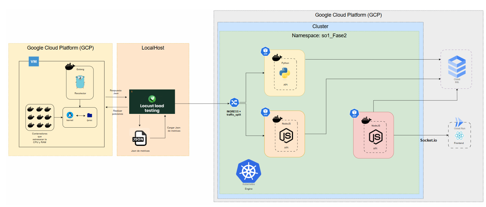
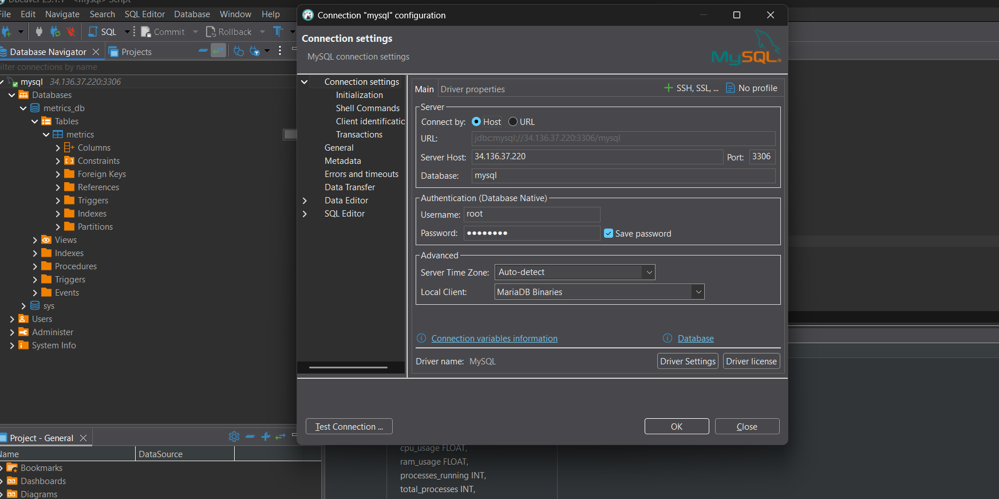
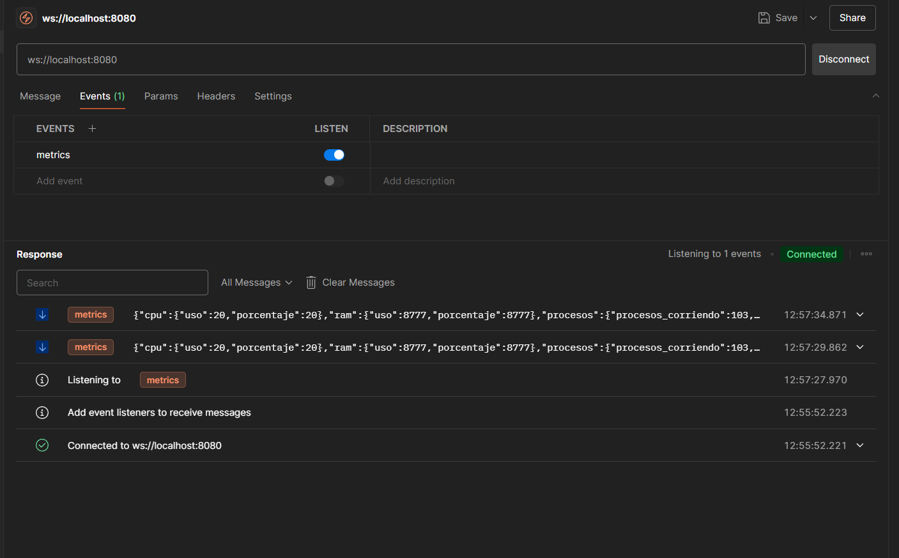

# Proyecto Fase 2: Monitoreo Cloud de VMs

## Tabla de Contenido

1. [Introducción](#introducción)
2. [Objetivos](#objetivos)
3. [Requerimientos del Proyecto](#requerimientos-del-proyecto)
4. [Arquitectura del Sistema](#arquitectura-del-sistema)
5. [Descripción de Componentes](#descripción-de-componentes)
6. [Configuración del Entorno Virtual para Locust](#configuración-del-entorno-virtual-para-locust)
7. [Guía de Uso de Locust](#guía-de-uso-de-locust)
8. [Guía de Despliegue en Kubernetes](#guía-de-despliegue-en-kubernetes)
9. [Referencias y Enlaces Útiles](#referencias-y-enlaces-útiles)

---

## Introducción

Este proyecto tiene como finalidad evaluar el rendimiento de una máquina virtual (VM) bajo condiciones de carga controladas, utilizando herramientas de monitoreo en tiempo real desplegadas sobre infraestructura en la nube (GCP). A través de contenedores y Kubernetes, se recolectan métricas como el uso de CPU, RAM y procesos activos, visualizándolas mediante una aplicación web React desplegada en Cloud Run.

## Objetivos

- Orquestar múltiples servicios mediante un clúster de Kubernetes.
- Monitorear métricas de CPU, RAM y procesos a través de módulos del kernel en C.
- Almacenar los datos en Cloud SQL mediante APIs desarrolladas en NodeJS y Python.
- Implementar un canal WebSocket para transmisión en tiempo real.
- Realizar pruebas de carga utilizando Locust para simular tráfico.
- Visualizar resultados a través de un dashboard interactivo en React.

## Requerimientos del Proyecto

### Software Requerido

| Herramienta             | Uso                                     |
| ----------------------- | --------------------------------------- |
| Docker                  | Contenerización de servicios           |
| Docker Hub              | Almacenamiento de imágenes             |
| Google Cloud SDK        | Administración de recursos GCP         |
| Kubernetes + kubectl    | Orquestación de contenedores           |
| Cloud SQL (MySQL)       | Almacenamiento persistente de métricas |
| Cloud Run               | Despliegue frontend                     |
| NodeJS                  | API de inserción y WebSocket           |
| Python + Flask          | API de inserción                       |
| ReactJS                 | Interfaz de usuario                     |
| Locust                  | Generador de tráfico                   |
| stress (polinux/stress) | Simulación de carga en la VM           |
| VS Code                 | Edición de código                     |
| Ubuntu 22.04+           | SO base del entorno local               |

---

## Arquitectura del Sistema



---

## Descripción de Componentes

### Módulos del Kernel

Tres módulos escritos en C:

- `cpu_201904013`: Utilización de CPU.
- `ram_201904013`: Uso de memoria RAM.
- `procesos_201904013`: Estado de los procesos.

Formato esperado de procesos:

```json
{
  "procesos_corriendo": 123,
  "total_procesos": 233,
  "procesos_durmiendo": 65,
  "procesos_zombie": 65,
  "procesos_parados": 65
}
```

### Recolector en Go

Servicio contenedorizado (imagen en DockerHub) que lee directamente los módulos y construye métricas que son consumidas por las APIs.

### Locust

Herramienta que genera tráfico en dos etapas:

1. Genera JSON de 2000 registros (~3 minutos, 300 usuarios).
2. Envia el JSON a las APIs (150 usuarios, cada 1-4 segundos).

### APIs

- **Python API**: Inserta métricas en Cloud SQL con campo `"api": "Python"`.
- **NodeJS API**: Inserta métricas en Cloud SQL con campo `"api": "NodeJS"`.
- **WebSocket API (NodeJS)**: Transmisión en tiempo real con `Socket.io`.

### Cloud SQL

MySQL gestionado. Almacena las métricas con esquema libre definido por el estudiante.

### Cloud Run

Despliega frontend React que muestra:

- Gráfica de RAM y CPU en tiempo real.
- Tabla de procesos (corriendo, zombie, dormidos, etc).

---

## Configuración del Entorno Virtual para Locust

Para poder ejecutar Locust y generar tráfico simulado para pruebas de carga, se recomienda trabajar con un entorno virtual de Python:

### Crear y Activar un Entorno Virtual

```bash
python3 -m venv venv
source venv/bin/activate
pip install locust
```

### Validar instalación

```bash
locust --version
```

---

## Guía de Uso de Locust

Ejecuta Locust:

```bash
locust
```

Accede a: [http://localhost:8089](http://localhost:8089)

### Archivo JSON de salida:

```json
{
  "total_ram": 2072,
  "ram_libre": 1110552576,
  "uso_ram": 442,
  "porcentaje_ram": 22,
  "porcentaje_cpu_uso": 22,
  "porcentaje_cpu_libre": 88,
  "procesos_corriendo": 123,
  "total_procesos": 233,
  "procesos_durmiendo": 65,
  "procesos_zombie": 65,
  "procesos_parados": 65,
  "hora": "2025-06-17 02:21:54",
  "api": "Python"
}
```

---

## Guía de Despliegue en Kubernetes

### Crear el Clúster en GCP

```bash
gcloud container clusters create so1-fase2 --num-nodes=3 --tags=allin,allout --machine-type=n1-standard-2 --zone us-central1-f
```

### Obtener credenciales e iniciar con `kubectl`

```bash
gcloud container clusters get-credentials so1-fase2 --region=us-central1-f
kubectl get nodes
```

### Crear Namespace y otorgar permisos

```bash
kubectl create namespace so1-fase2
kubectl config set-context --current --namespace=so1-fase2
kubectl create clusterrolebinding admin-so1-fase2 --clusterrole=cluster-admin --serviceaccount=so1-fase2:default
kubectl auth can-i list services --namespace=so1-fase2 --as=system:serviceaccount:so1-fase2:default
```

### Aplicar secretos y archivos de configuración

```bash
kubectl apply -f python-api-secret.yaml
kubectl apply -f node-api-secret.yaml
```

### Consultar recursos del clúster

```bash
kubectl get services
kubectl get ingress
```

### Reiniciar despliegues

```bash
kubectl rollout restart deployment node-api -n so1-fase2
```

### Eliminar YAML (en caso necesario)

```bash
kubectl delete -f file.yaml
```

---

## Conexión a bd cloud



## Test de Socket con Postman




## Referencias y Enlaces Útiles

- [Instalar GCP CLI](https://cloud.google.com/sdk/docs/install)
- [Google Cloud Console](https://console.cloud.google.com/)
- [Cloud Run](https://cloud.google.com/run/)
- [Cloud SQL](https://cloud.google.com/sql)
- [Docker Hub - stress](https://hub.docker.com/r/polinux/stress)
- [Video CLI GCP Windows](https://youtu.be/rpmOM5jJJfY?si=3YYzFDSwXd8rPdth)
- [Video CLI GCP Ubuntu](https://youtu.be/zERGwIeAhfc?si=aRrptzORO6CwW8pm)
